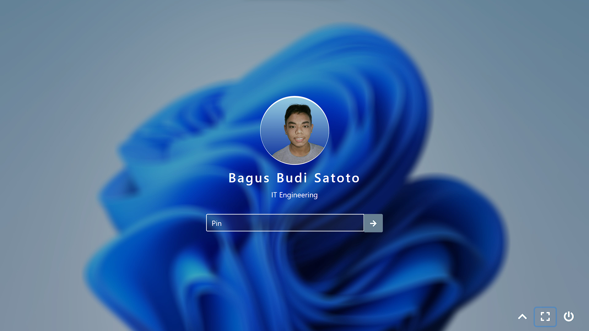
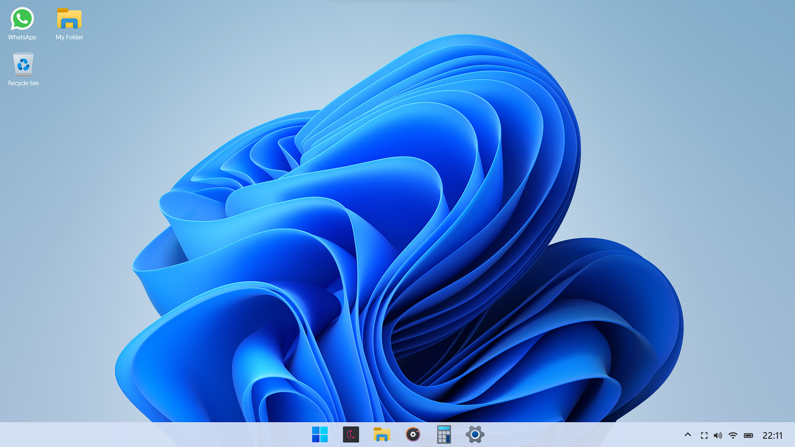
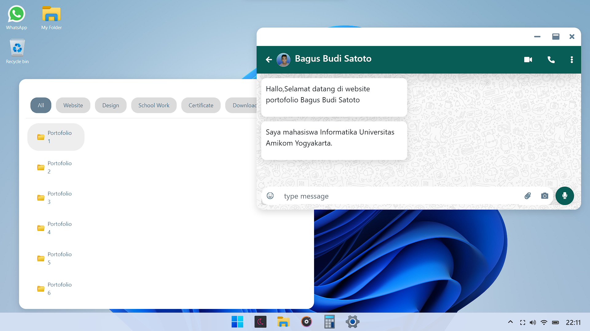

<h1 align="center">Windows 11 Themes</h1>
<H2 align="center">Project My Portofolio</H2>

<!-- Garis Lurus -->
 
<!-- End -->


<br>

<!-- Garis Lurus -->
 
<!-- End -->


<br>

<!-- Garis Lurus -->
 
<!-- End -->


<br>

## 📌 About
> **Windows 11 Themes** adalah sebuah website dimana pengguna dapat meelihat tampilan tema Windows 11. 
<br>

> Dengan menggunakan tema Windows 11, pengguna dapat mengubah tampilan website menjadi tampilan yang lebih menarik.

<!-- Garis Lurus -->
 
<!-- End -->

## 🗃️ Langueges and Tools
- [HTML](https://www.w3schools.com/html/html_intro.asp)
- [CSS](https://www.w3schools.com/css/css_intro.asp)
- [Javascript](https://www.javascript.com/)
- [Audio Visual](https://www.audiovisual.com/)

<!-- Garis Lurus -->
 
<!-- End -->

## 👦🏽 Siapa pembuat aplikasi ini?

| Profile        |  Keterangan                      |
|----------------|----------------------------------|
| Nama           | Bagus Budi Satoto                |
| Jurusan        | S1 - Informatika                 |
| Kampus         | Universitas Amikom Yogyakarta    |

<!-- Garis Lurus -->
 
<!-- End -->

## 🔗 Cara Install
<br>

- <code>git clone ↆↆ </code>
  
  ```bash
  git clone 
  ``` 
  
- <code>cd windows 11</code>
- <code>npm install</code>
- <code>npm run dev</code>

<!-- Garis Lurus -->
 
<!-- End -->

## 💻 Testing Demo

- [Demo Windows 11](https://www.audiovisual.com/windows-11/)


<!-- Garis Lurus -->
 
<!-- End -->

## 📌 Request Fitur Baru dan Pelaporan Bug

Anda dapat meminta fitur baru maupun melaporkan bug melalui menu **issues** yang sudah disediakan oleh GitHub (lihat menu di atas), posting issues baru dan kita akan berdiskusi disana.

## 🛒 Berkontribusi

Siapapun dapat berkontribusi pada proyek ini mulai dari pemrograman, pembuakan buku manual, sampai dengan mengenalkan produk ini kepada Mahasiswa 
Untuk belajar agar mengurangi kesenjangan pendidikan teknologi dengan cara membuat postingan issue di repository ini.


> 🧑🏽‍💻 | [BAGUS BUDI SATOTO ](http://github.com/bagussatoto)
<br>
 